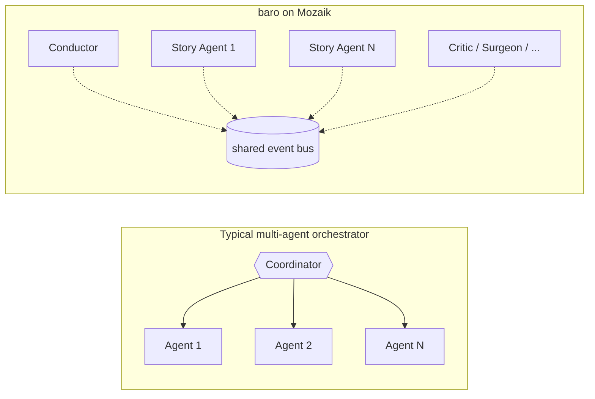
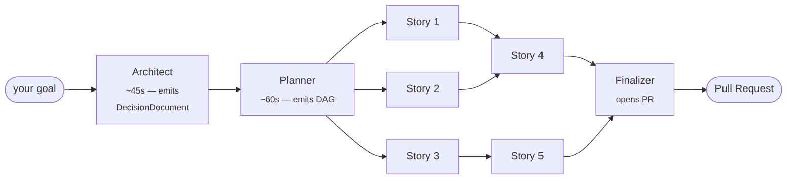

# baro

> Type a goal in your repo. Walk away. Come back to a pull request.

  


```bash
npm install -g baro-ai
```

## Parallel coding agents, no central coordinator

Most multi-agent setups have one orchestrator function in the middle that drives N agents. The orchestrator becomes the bottleneck the moment you push past a handful of concurrent agents — and adding a new behaviour means editing its control flow.

baro doesn't have that shape. Every part of the run is an independent **participant** on a shared event bus ([Mozaik](https://github.com/jigjoy-ai/mozaik)). N parallel story agents are N independent subprocesses, each emitting and consuming typed events. There is no central `run()` to bottleneck on, and adding a new behaviour is a new participant — not an orchestrator rewrite.



That's the architectural lever. Everything else baro does — Architect, Planner, Critic, Surgeon, Librarian — is a participant on that bus. They don't call each other; they react to events.

## What a run looks like

```bash
cd your-repo
baro "Add JWT authentication with role-based access control"
```

```
→ Architect (45s)   — design decisions pinned for every story
→ Planner   (38s)   — 7 stories in 3 levels
→ Executing — 4 parallel Claude Code agents on baro/jwt-auth branch
→ Critic    — per-turn acceptance evaluation, self-corrects on fail
→ Finalizer — PR #142 opened ✓
```



Every story is one **Claude Code subprocess** (or one Mozaik-native OpenAI session) — auth inherits from your existing setup, no API key plumbing.

## Recent real run

[**How baro generated 808 NestJS Jest tests autonomously in 71 minutes**](https://jigjoy.ai/blog/baro-808-nestjs-jest-tests) — one prompt, 33-story DAG, two sessions because of the Anthropic 3am usage cap, 64 test suites, 83.5% branch coverage, +13,606 lines of test code, zero phantom bug issues filed.

## What each participant does

| Participant | Role |
|---|---|
| **Architect** | One Opus call before planning — emits a `DecisionDocument` that pins every cross-cutting design decision (file paths, schemas, API shapes, library choices) so 30 parallel agents don't each invent their own |
| **Planner** | Decomposes the goal into a story DAG, with the DecisionDocument already pinned |
| **Conductor** | State machine that drives the run by reacting to bus events |
| **StoryAgent** | One Claude Code subprocess per story; multi-turn loop until story completes |
| **Critic** | Per-turn evaluator (Haiku). On fail verdict, injects corrective feedback as the agent's next turn |
| **Sentry** | Flags overlapping Edit/Write tool calls across concurrent stories |
| **Librarian** | Indexes one agent's Read/Grep findings so siblings don't redo the exploration |
| **Surgeon** | On terminal failure, asks Opus for a richer replan (split / prereq / rewire) |
| **Finalizer** | Runs build verification, opens the GitHub PR with stories table + stats |

Bus is open. CI deployers, Slack notifiers, ticket triggers — all new participants, no orchestrator changes. Architecture deep-dive: [I tested Claude Code's new /goal feature against my parallel agent setup](https://jigjoy.ai/blog/baro-vs-claude-code).

## Try it

```bash
npm install -g baro-ai

# Full run (default — Architect + Planner + parallel Story Agents)
baro "Migrate the hardcoded category data to a backend dictionary"

# Trivial goal — skip Architect + Critic + Surgeon, single story
baro --quick "fix the typo on line 42 of README.md"

# Route every phase through GPT-5.5 instead of Claude
OPENAI_API_KEY=sk-... baro --llm openai "Refactor the database layer"

# Limit parallelism (Anthropic plan tiers cap concurrency)
baro --parallel 3 "Add unit tests for the auth module"

# Dry-run first, execute later
baro --dry-run "Add WebSocket support"
baro --resume

# Self-diagnostic
baro --doctor
```

Full options + `.barorc` config + per-phase model overrides: [**docs.baro.rs**](https://docs.baro.rs).

## How it compares

| | Single Claude Code session | DIY `Promise.all` of subprocesses | baro |
|---|---|---|---|
| **Plans the work** | you | you | Planner agent |
| **Pins design decisions** | implicit, drifts | n/a | Architect agent (`DecisionDocument`) |
| **Parallel agents** | no — one session | yes, you coordinate | yes, on Mozaik bus |
| **Mid-flight peer awareness** | n/a | implement yourself | Librarian broadcasts |
| **Replan on failure** | manual | manual | Surgeon agent |
| **Opens the PR** | manual | manual | Finalizer |
| **Adding a new behaviour** | new prompt | refactor orchestrator | new bus participant |

For a deeper side-by-side on a real refactor, see [baro vs Claude Code `/goal`](https://jigjoy.ai/blog/baro-vs-claude-code).

## Requirements

- [Claude CLI](https://docs.anthropic.com/en/docs/claude-cli) authenticated (for `--llm claude`, the default) **or** `OPENAI_API_KEY` set (for `--llm openai`)
- Node.js 20+
- macOS (arm64/x64), Linux (x64/arm64), Windows (x64)
- `gh` CLI (optional, for automatic PR creation)

## Status & feedback

baro is a work in progress. If a run explodes, the audit log at `~/.baro/runs/<run-id>.jsonl` is the fastest way to get it fixed — open an [issue](https://github.com/jigjoy-ai/baro/issues) with that file attached.

Ideas, use cases, bug reports — Discord: [**discord.gg/dvxY9J2kWX**](https://discord.gg/dvxY9J2kWX) · Twitter: [**@lotus_sbc**](https://twitter.com/lotus_sbc)

## License

MIT — [JigJoy](https://jigjoy.ai/) team
