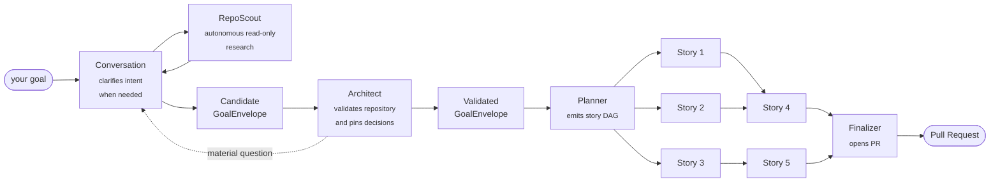
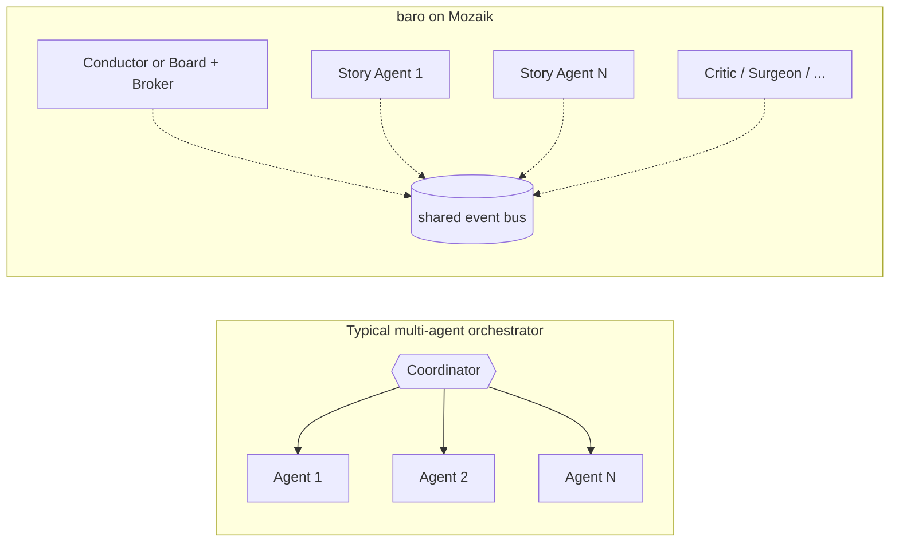

# baro

> Type a goal in your repo. Walk away. Come back to a pull request.

  

### One prompt → a 33-story plan → 808 passing tests → a pull request. In 71 minutes.

No babysitting. No copy-paste. No "now do the next file." A fleet of coding agents
planned the work, built it in parallel across isolated branches, reviewed each other,
and opened the PR — from a single sentence.

▸ [**See what happened**](https://jigjoy.ai/blog/baro-808-nestjs-jest-tests) — 33-story DAG, 64 test suites, 83.5% branch coverage, +13,606 lines, zero phantom bugs filed.

```bash
npm install -g baro-ai
cd your-repo
baro "Add JWT authentication with role-based access control"
```

**No machine, or no Claude/Codex subscription?** Run the same fleet on **baro's cloud** — nothing to install, each run in an isolated sandbox, pay as you go. → **[app.baro.jigjoy.ai](https://app.baro.jigjoy.ai)**


<sub>baro at the end of an [actual run](https://jigjoy.ai/blog/baro-808-nestjs-jest-tests) — one prompt → 33-story DAG → 32 files modified → PR opened. The summary panel shows wall time, parallel speedup (2.2×), token usage, and the PR URL.</sub>

## What you actually get

You write one sentence. baro does the rest:

- **You describe the goal** — a conversation agent either confirms the scope or asks only the questions that materially change it.
- **An Architect pins the design** — file paths, schemas, API shapes, library choices — so dozens of agents don't each invent their own.
- **A Planner splits it into a DAG of stories** — with dependencies, so independent work runs at the same time.
- **A fleet of agents builds it in parallel** — not one chat agent typing for an hour, dozens, each in its own isolated git branch.
- **It reviews and repairs itself** — a tool-less Critic gates supported routes and corrects live workers on failure; a Surgeon replans stories that get stuck.
- **You get a pull request** — build-verified, with a stories table and run stats.



## Why it's fast: a real fleet, not one chat agent

Most tools give you a single agent in a chat box. baro plans your goal into a DAG and
runs a whole fleet at once — every independent story is scheduled in parallel in its
own git worktree. CLI routes use subprocesses, while native OpenAI-compatible routes
run in-process:

```bash
cd your-repo
baro "Add JWT authentication with role-based access control"
```

```
→ Architect (45s)   — design decisions pinned for every story
→ Planner   (38s)   — 7 stories in 3 levels
→ Executing — 4 parallel agents on baro/jwt-auth branch
→ Critic    — per-turn acceptance evaluation, self-corrects on fail
→ Finalizer — PR #142 opened ✓
```

That parallelism is where the 2.2× speedup in the run above comes from — and it scales
with the width of your DAG, not the patience of a single session.

## Use any model — or mix them

Same orchestration, same DAG, same prompts. The only thing that moves is which provider
each agent talks to. Auth inherits from whichever CLI you already have signed in — no API
key plumbing for the subscription backends.

```bash
baro --llm claude    "Your goal"   # default — Claude Code on Anthropic Max subscription
baro --llm codex     "Your goal"   # Codex CLI for every phase, including isolated evidence review
baro --llm codex --critic-llm claude "Your goal" # Codex execution + tool-less Claude review
baro --llm openai    "Your goal"   # Mozaik-native OpenAI (per-call API billing)
baro --llm opencode  "Your goal"   # OpenCode CLI — multi-provider agent shell (any model)
baro --llm hybrid    "Your goal"   # Claude on Architect/Planner/Critic/Surgeon, Codex on Story
```

`--llm hybrid` is the recommendation for serious runs — Claude for planning,
tool-less review, and recovery; Codex for parallel story work. A pure Codex run
reviews only Baro-captured evidence in an isolated least-privilege process. Each phase
also has its own override flag if you want to mix it yourself:

```bash
baro --architect-llm claude   \
     --planner-llm  claude   \
     --story-llm    opencode \
     --critic-llm   claude   \
     --surgeon-llm  claude   \
     "Your goal"
```

### Custom OpenAI-compatible endpoints

Any provider that exposes an OpenAI-compatible Chat Completions API works with `--llm openai`.
Set `OPENAI_BASE_URL` to point at your endpoint and pass any model name via `--story-model`:

```bash
# Xiaomi MiMo
OPENAI_API_KEY=your-key OPENAI_BASE_URL=https://api.mimo.xiaomi.com/v1 \
  baro --llm openai --story-model MiMo-7B-RL "Your goal"

# OpenRouter (any model)
OPENAI_API_KEY=your-key OPENAI_BASE_URL=https://openrouter.ai/api/v1 \
  baro --llm openai --story-model anthropic/claude-3.5-sonnet "Your goal"

# Local vLLM / Ollama
OPENAI_API_KEY=not-needed OPENAI_BASE_URL=http://localhost:11434/v1 \
  baro --llm openai --story-model llama3 "Your goal"
```

The `--openai-base-url` flag also works (wins over the env var when both are set).

### OpenCode (multi-provider agent shell)

[OpenCode](https://opencode.ai) is an open-source coding agent that supports any LLM provider.
With `--llm opencode`, baro delegates story execution to the `opencode` CLI. Model selection
uses the `-m provider/model` format:

```bash
baro --llm opencode -m anthropic/claude-sonnet-4 "Your goal"   # Claude via OpenCode
baro --llm opencode -m openai/gpt-4o "Your goal"               # OpenAI via OpenCode
baro --llm opencode -m lmstudio/qwen3-coder "Your goal"        # local model

# Mix: Claude plans, OpenCode executes stories.
baro --architect-llm claude --planner-llm claude \
     --story-llm opencode "Your goal"
```

OpenCode manages its own API keys and per-provider model defaults via `opencode providers` —
no extra env vars, and no `-m` required when you're happy with its default. `-m provider/model`
sets the model for **all** phases at once, so use it only when every phase runs on a non-Claude
backend. Runs with `--dangerously-skip-permissions` for unattended execution in baro's per-story
worktrees.

Full breakdown at [docs.baro.rs/llm-providers](https://docs.baro.rs/llm-providers) — provider
economics, per-phase routing, and the side-by-side benchmark across three real tasks:
[**I tested Claude Code vs OpenAI Codex in my parallel agent setup. Then I built a hybrid.**](https://jigjoy.ai/blog/claude-code-vs-codex-baro)

### Per-story model tiering (mixed fleet)

`--llm` / `--story-llm` pick a backend per *phase* — every story runs on the same one. With
`--tier-map` you tier per *story* instead: the Planner tags each story with a blast-radius tier
(`light` = mechanical/self-contained, `standard` = one contained module, `heavy` = cross-cutting /
schema / a DAG hub — "what breaks if an agent gets this wrong?"), and the tier map binds each
tier to a concrete `backend:model`. One DAG, several backends, chosen by risk:

```bash
# Cheap single-concern stories on MiniMax, cross-cutting stories on Claude Opus
baro --openai-endpoint minimax=https://api.minimax.io/v1 \
     --tier-map "light=openai:MiniMax-M3@minimax,standard=openai:MiniMax-M3@minimax,heavy=claude:opus" \
     "Your goal"
```

Tiers are a blast-radius class, not a model: a `heavy` story may well run on DeepSeek or GPT —
whatever its route says. The legacy tier spellings `haiku`/`sonnet`/`opus` are still accepted
everywhere a tier can appear (story `model` fields, `--tier-map` keys, `BARO_TIER_MAP`), so old
PRDs and maps keep working unchanged.

A story's route can name **any** backend (`claude:opus`, `openai:MiniMax-M3`, `codex:gpt-5.5`) and
an OpenAI route can name its **own endpoint** with `@` — a registered name (`--openai-endpoint
name=url`, repeatable) or an inline `@https://…` URL — so a single run can hit several
OpenAI-compatible endpoints at once. API keys are never put on the command line: each endpoint
resolves its key from `BARO_OPENAI_KEY_<NAME>`, falling back to `OPENAI_API_KEY`. When the Surgeon
splits a failed story, it tiers the pieces and escalates a tier up for any same-scope replacement.
Without `--tier-map`, per-story tiers resolve on the phase backend exactly as before.

## Under the hood: participants on an event bus

Most multi-agent setups have one orchestrator function in the middle that drives N agents. The
orchestrator becomes the bottleneck the moment you push past a handful of concurrent agents — and
adding a new behaviour means editing its control flow.

Every new run starts with a durable conversation session. Goal and clarification
turns first enter a short-lived pre-PRD Mozaik environment: Conversation requests
a bounded repository brief over semantic events, and a Baro-owned `RepoScout`
first builds a deterministic snapshot, then autonomously chooses bounded
`read_file`, literal `grep`, or `glob` observations until it can finish a
structured evidence brief. Baro, not the model, executes those shell-free
tools; observed symlinks, known credential/key/cloud-state paths, generated work
directories, binary files and configured work/byte limits are excluded. On
success, the brief identity hashes the exact bootstrap projection and ordered
observation suffix visible in the finishing policy call, including its omission
count; it identifies the evidence set, not the semantic truth of model-authored text.
Clipped bootstrap paths are not trusted until Scout rediscovers them, and an
omitted observation suffix forces an explicitly truncated result.
This is a capability boundary, not a proof that model-authored summaries or
questions are immune to repository prompt injection; they remain untrusted model output.
Fact paths require bootstrap/read/search provenance, and an optional source line
must have been visibly returned by read/search. A malformed decision receives a
bounded same-step repair, while Scout provider failure performs a final stability
rescan and falls back to the latest deterministic snapshot so Conversation can
still be attempted; Conversation itself still requires the selected provider.
RepoScout and the provider-facing Conversation model run as
separate roles in an empty temporary harness directory. They default to the
same selected backend/model, but use independent provider-neutral seams so the
Scout can later be routed to a cheaper model. Claude, OpenCode and Pi receive
explicit no-tool profiles. Codex runs with a strict least-privilege permission
profile: its empty workspace is denied, tool network and inherited shell
environment are disabled, and user/project config and rules are ignored. Large
Claude/Codex prompt payloads travel over stdin instead of argv for Windows-safe
launches. Repository
observations remain explicitly untrusted data; neither role can choose workers,
routes, leases or DAG mutations. Chat turns also request context because a chat
response may identify a new implementation follow-up and return `ready`.

A `ready` GoalEnvelope is only a candidate. Every provider route runs a
pre-acceptance Architect validation before the durable session accepts it. The
Claude Code, Codex and native OpenAI-compatible routes can inspect the checkout
with repository read-only capabilities. OpenCode and Pi have no equivalent
repository read-only CLI profile, so their pre-acceptance Architect runs as an
inference-only evaluator in an empty directory and receives only Baro's bounded,
brokered repository context. The Architect may return repository-cited questions;
when it returns `ready`, the same validated decision document is reused by Planner,
so there is no second Architect charge. Quick mode keeps its existing single-story
Architect skip.

The pre-acceptance Codex Architect keeps the checkout as its read-only working
root so its normal search tools can investigate it, but starts with strict CLI
config and `project_doc_max_bytes=0`. This prevents repository-owned
`AGENTS.md`/project documents from becoming model instructions before the goal
is trusted; their contents remain ordinary repository evidence if Codex
explicitly reads them during investigation.

The broker rejects symlinks it observes, but a concurrently hostile checkout can
still race path checks. Use a disposable, remote-free immutable clone when hard
filesystem isolation is required.

The execution runtime then uses one shared event bus
([Mozaik](https://github.com/jigjoy-ai/mozaik)). Its Board/Conductor, factories, critics and
other observers are participants; N parallel story agents are N independently scheduled
executions whose activity is projected onto typed events. CLI routes use subprocesses and a
local bridge, while native OpenAI-compatible routes run in-process. Architect and Planner run
before this execution environment. The default `collective` engine splits
allocation, leases, integration and completion across participants and lets workers publish peer
messages and propose versioned changes to the not-yet-started DAG. The Board validates and
persists the complete candidate before it reports the change as applied; active stories remain
fenced until a correlated revocation lifecycle exists. `legacy` remains as the explicit
Conductor compatibility path for old-run comparison and rollback.

Fresh headless Collective runs also have an experimental progressive-planning
path. With `BARO_PROGRESSIVE_PLANNING=1`, a native OpenAI-compatible Planner
(including GLM on that route) may publish dependency-closed, add-only story
fragments through Mozaik while it continues planning. The Board validates and
durably admits each fragment before it can execute, and the final PRD must keep
the admitted stories as an exact prefix. CLI Planner backends currently retain
the complete-plan barrier. Resume and follow-up runs are not eligible for this
version; interactive and `legacy` runs are unchanged. See
[Collective runtime architecture](docs/collective-runtime.md#progressive-planning-experimental-opt-in)
for the fail-closed lifecycle, limitations and provider-free checks. This
opt-in is an evaluation surface, not a production-readiness or benchmark claim.

Try the collective engine with Baro-owned pushes and PR creation disabled:

```bash
baro --local-only "Your goal"
```

In collective mode, the same user-facing session also has a run-local
`DialogueAgent` on the bus:

```bash
baro --local-only "Your goal"
```

It is text-only, receives no repository tools, and cannot grant leases, mutate
the DAG directly, integrate work, verify the run, or report success. It may
explain the bounded run projection, message an active worker, or submit a
versioned add-only proposal that the Board independently validates. Removing it
does not stop the collective. While a run is active, press `c` for collective chat;
`m` still sends a direct message to the selected worker. Direct/headless
clients can use the `dialogue_message` stdin event. Local Claude Code and Codex
runs pass continuity through a PRD-bound, size-limited temporary snapshot that
is deleted when the orchestrator exits; the transcript is not copied into the
repository.

Use `--coordination legacy` only when you explicitly want the earlier Conductor
compatibility path.
For hard network isolation, point it at a disposable clone with its git remotes removed;
story agents can execute shell commands, so `--local-only` is a coordinator policy, not an OS sandbox.

Collective mode can also run an opt-in worker market. Candidate workers advertise safe route
descriptors and submit bounded cost/latency/success estimates; the Broker applies policy and picks
one winner deterministically. Credentials and endpoint URLs remain local to the worker. The
estimates are configuration until they have been calibrated from externally verified runs — they
are not presented as measured truth. See the [local collective experiment](docs/collective-experiment.md)
and [candidate example](docs/collective-workers.example.json).



| Participant | Role |
|---|---|
| **Architect** | One strong-model design pass before planning — for read-only-capable routes it first validates the candidate goal and may return repository-cited questions; its accepted `DecisionDocument` is reused by Planner without a second call |
| **Planner** | Decomposes the goal into a story DAG, with the DecisionDocument already pinned |
| **Conversation session** | Durable first contact and sole user-facing intake authority: clarifies intent, persists a repository-scoped correlated transcript across pre-PRD restarts, and hands exactly one accepted GoalEnvelope to planning |
| **RepoScout** | Source-bound autonomous researcher in the short-lived pre-PRD Mozaik lane. It iteratively chooses from Baro-owned read/search/glob capabilities and returns a frozen 64 KiB evidence brief; deterministic retrieval remains its bootstrap and fail-safe. It cannot plan, route work, mutate the DAG, run code, use the network, or write the checkout |
| **Conductor** | Explicit `legacy` compatibility state machine that drives DAG levels by reacting to bus events |
| **Board + Broker** | Default collective policy: projects run state, collects worker bids, grants correlated leases, atomically validates versioned future-DAG proposals and never treats process exit as proof of success |
| **DialogueAgent** | Automatic collective participant that continues the bounded conversation during a run and may message active workers or submit Board-validated add-only proposals, but has no control-plane authority |
| **StoryAgent** | One isolated worker per story and git worktree. Native OpenAI runs in-process through Mozaik; Claude Code is a multi-turn CLI worker, while Codex, OpenCode and Pi story workers are currently one-shot CLI processes |
| **Critic + AcceptanceGate** | Evaluates terminal output against acceptance criteria. Live backends can consume corrective turns; one-shot backends produce a blocking verdict that triggers recovery instead of a message to a dead process |
| **Sentry** | Flags overlapping Edit/Write tool calls across concurrent stories |
| **Librarian** | Indexes one agent's Read/Grep findings so siblings don't redo the exploration |
| **Surgeon** | On execution, integration or acceptance failure, proposes a bounded replan (split / prerequisite / rewire / escalation) |
| **RunVerifier / Finalizer** | Produces correlated build/test evidence for collective completion; optional publishing reuses that evidence when opening the PR |

In collective mode, an active leased worker may propose an atomic change to
the not-yet-started part of the story DAG. Native OpenAI receives a
closed-schema `propose_replan` tool inside its Mozaik inference loop; CLI
workers use the same correlated semantic events through the local
`agent-collab.mjs` bridge. The Board remains the only mutation authority and
emits `runtime_replan_applied` only after the new graph and version are
durable. See [the local collective experiment guide](docs/collective-experiment.md#runtime-dag-adaptation)
for the safety and replay contract.

The bus is open. CI deployers, Slack notifiers, ticket triggers — all new participants, no
orchestrator changes. Architecture deep-dive:
[I tested Claude Code's new /goal feature against my parallel agent setup](https://jigjoy.ai/blog/baro-vs-claude-code).

## Semantic memory (cross-agent context sharing)

baro includes an optional semantic memory system that lets parallel story agents share discoveries
in real time. When one agent reads a file or greps a pattern, the finding is embedded (CPU-only
ONNX, no API calls) and stored in a local [Vectra](https://github.com/stevenic/vectra) vector index
on disk. Other agents query this shared memory mid-flight, so siblings don't redo the same
exploration — roughly 50% fewer findings injected, because only semantically relevant ones surface.

```
Orchestrator                         Story Agents (parallel)
────────────                         ──────────────────────
intercepts Read/Grep/Bash outputs    $ baro-memory query "auth"
  → embeds via ONNX MiniLM            → reads Vectra index from disk
  → stores in Vectra LocalIndex        → returns relevant findings
  → caches file content              $ baro-memory cache get src/auth.ts
                                       → returns cached content (no disk read)
```

```bash
baro "your goal"           # memory enabled by default
baro --no-memory "goal"    # disable (falls back to tag-based Librarian)
BARO_DEBUG=memory baro ... # debug logging to stderr + ~/.baro/runs/memory-*.log
```

**Helps most:** large codebases (20+ files) with overlapping exploration, staggered DAGs where
later stories benefit from earlier ones, runs with 5+ stories touching the same subsystems.
**Adds slight overhead with no benefit:** small codebases (1–3 files), fully parallel DAGs with no
dependencies, quick single-story tasks (`--quick`). It adds ~1s startup (ONNX model load) and is
session-scoped — data lives in `~/.baro/sessions/run-<timestamp>/memory/` and is discarded after the run.

## Try it

```bash
npm install -g baro-ai

# Full run (default — Claude on every phase via Claude Code CLI)
baro "Migrate the hardcoded category data to a backend dictionary"

# Trivial goal — skip Architect + Critic + Surgeon, single story
baro --quick "fix the typo on line 42 of README.md"

# Codex everywhere (ChatGPT Pro/Plus subscription, ~3-11× cheaper per run than Claude)
baro --llm codex "Refactor the database layer"

# Per-phase routing — Claude upstream (tight plans), Codex downstream (cheap writes)
baro --llm hybrid "Add WebSocket support across api and frontend"

# Route every phase through GPT-5.5 (Mozaik-native OpenAI API)
OPENAI_API_KEY=sk-... baro --llm openai "Refactor the database layer"

# Route through any OpenAI-compatible endpoint (Xiaomi MiMo, OpenRouter, vLLM, Ollama, etc.)
OPENAI_API_KEY=your-key OPENAI_BASE_URL=https://api.mimo.xiaomi.com/v1 baro --llm openai "Refactor the database layer"

# Limit parallelism (plan-tier concurrency caps)
baro --parallel 3 "Add unit tests for the auth module"

# Dry-run first, execute later
baro --dry-run "Add WebSocket support"
baro --resume

# Self-diagnostic
baro --doctor
```

Full options + `.barorc` config + per-phase model overrides: [**docs.baro.rs**](https://docs.baro.rs).

## Run it from the cloud — `baro connect`

baro can also run as a **remote runner** for baro-cloud: fire a goal from a web
dashboard, a teammate, or a GitHub issue labeled `baro`, and it executes here on
your machine over your own subscription — your code never leaves it. baro-cloud
orchestrates (Architect/Planner/Critic/Surgeon) and never sees your source, only
metadata + diffs. Pair a machine with one line:

```bash
curl -fsSL https://api.baro.jigjoy.ai/install.sh | sh -s -- --token rt_…
```

That installs baro and registers a background **service** that survives terminal
close, logout, and reboot — launchd (macOS), systemd (Linux), or a logon task
(Windows). Or do it by hand:

```bash
baro connect --install-service --token rt_…   # persistent background service
baro connect --token rt_…                      # foreground, this terminal only
baro connect --uninstall-service               # remove the service
```

Get a pairing token (`rt_…`) from baro-cloud → Runners. A mid-run network blip
won't kill a run: the runner reconnects and resumes streaming where it left off.

**No machine or subscription?** baro-cloud can also run a goal entirely on
**baro's cloud** — each run executes in an isolated sandbox on our infrastructure,
billed from prepaid credits. Pick **☁ baro's cloud** in the dashboard (no runner
to pair) at [app.baro.jigjoy.ai](https://app.baro.jigjoy.ai).

## What Baro adds to a coding harness

Modern coding harnesses can already plan, use subagents and run work in
parallel; those capabilities are not Baro's unique claim. The collective
experiment focuses on an explicit control plane around heterogeneous workers:

| Capability | Typical single-vendor harness | DIY parallel processes | Baro collective |
|---|---|---|---|
| **Model/provider mix** | vendor-specific | wire it yourself | per-story routes and deterministic bids |
| **Plan state** | session-internal | application-specific | explicit, versioned DAG |
| **Work ownership** | harness-internal | wire it yourself | correlated offers, leases and authority fencing |
| **Runtime adaptation** | harness-specific | wire it yourself | validated future-DAG transaction, persist-before-Applied |
| **Auditability** | harness logs | build it yourself | typed semantic event and model-usage audit |
| **Completion evidence** | model/harness result | build it yourself | Critic gate, repository integration and objective verifier |
| **Cost/quality routing** | vendor model family | build it yourself | provider-neutral policy surface (estimates must be calibrated) |

For a historical side-by-side on one real refactor, see [baro vs Claude Code `/goal`](https://jigjoy.ai/blog/baro-vs-claude-code). Treat it as a case study, not a current capability matrix.

## Requirements

- At least one of:
  - [Claude CLI](https://docs.anthropic.com/en/docs/claude-cli) authenticated (for `--llm claude`, the default)
  - [OpenAI Codex CLI](https://github.com/openai/codex) authenticated (for `--llm codex`)
  - [OpenCode CLI](https://opencode.ai) with a provider configured (for `--llm opencode`)
  - `OPENAI_API_KEY` set (for `--llm openai`)
  - `OPENAI_BASE_URL` set to a custom endpoint (optional, for `--llm openai` — routes through Xiaomi MiMo, OpenRouter, vLLM, Ollama, or any OpenAI-compatible API)
  - Both Claude CLI **and** Codex CLI authenticated (for `--llm hybrid`)
- Node.js 20+
- macOS (arm64/x64), Linux (x64/arm64), Windows (x64)
- `gh` CLI (optional, for automatic PR creation)

## Status & feedback

baro is a work in progress. If a run explodes, the audit log at `~/.baro/runs/<run-id>.jsonl` is
the fastest way to get it fixed — open an [issue](https://github.com/jigjoy-ai/baro/issues) with
that file attached.

Ideas, use cases, bug reports — Discord: [**discord.gg/dvxY9J2kWX**](https://discord.gg/dvxY9J2kWX) · Twitter: [**@lotus_sbc**](https://twitter.com/lotus_sbc)

## License

MIT — [JigJoy](https://jigjoy.ai/) team
