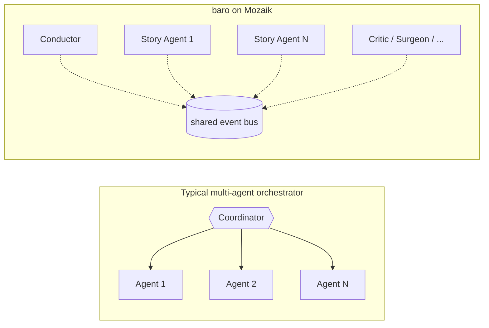

# baro

> Type a goal in your repo. Walk away. Come back to a pull request.

  

```bash
npm install -g baro-ai
```


<sub>baro TUI at the end of an [actual run](https://jigjoy.ai/blog/baro-808-nestjs-jest-tests) — one prompt → 33-story DAG → 32 files modified → PR opened. The summary panel shows wall time (33:23), parallel speedup (2.2×), token usage, and the PR URL.</sub>

## Parallel coding agents, no central coordinator

Most multi-agent setups have one orchestrator function in the middle that drives N agents. The orchestrator becomes the bottleneck the moment you push past a handful of concurrent agents — and adding a new behaviour means editing its control flow.

baro doesn't have that shape. Every part of the run is an independent **participant** on a shared event bus ([Mozaik](https://github.com/jigjoy-ai/mozaik)). N parallel story agents are N independent subprocesses, each emitting and consuming typed events. There is no central `run()` to bottleneck on, and adding a new behaviour is a new participant — not an orchestrator rewrite.



That's the architectural lever. Everything else baro does — Architect, Planner, Critic, Surgeon, Librarian — is a participant on that bus. They don't call each other; they react to events.

## What a run looks like

```bash
cd your-repo
baro "Add JWT authentication with role-based access control"
```

```
→ Architect (45s)   — design decisions pinned for every story
→ Planner   (38s)   — 7 stories in 3 levels
→ Executing — 4 parallel Claude Code agents on baro/jwt-auth branch
→ Critic    — per-turn acceptance evaluation, self-corrects on fail
→ Finalizer — PR #142 opened ✓
```


Every story is one CLI subprocess — Claude Code, OpenAI Codex CLI, or a Mozaik-native OpenAI Responses session, depending on `--llm`. Auth inherits from whichever CLI you already have signed in, no API key plumbing.

## Three LLM backends, one DAG

```bash
baro --llm claude  "Your goal"   # default — Claude Code on Anthropic Max subscription
baro --llm codex   "Your goal"   # OpenAI Codex CLI on ChatGPT Pro/Plus subscription
baro --llm openai  "Your goal"   # Mozaik-native OpenAI Responses (per-call API billing)
baro --llm hybrid  "Your goal"   # Claude on Architect/Planner/Surgeon, Codex on Story/Critic
```

Same orchestration. Same DAG. Same prompts. The only thing that moves is which provider every agent talks to. `--llm hybrid` is the new default-recommendation for serious runs — Claude where the upstream plan matters, Codex for the parallel story+critic work that dominates the budget.

Each phase has its own override flag if you want to mix it yourself:

```bash
baro --architect-llm claude \
     --planner-llm  claude \
     --story-llm    codex  \
     --critic-llm   codex  \
     --surgeon-llm  claude \
     "Your goal"
```

### Custom OpenAI-compatible endpoints

Any provider that exposes an OpenAI-compatible Chat Completions API works with `--llm openai`. Set `OPENAI_BASE_URL` to point at your endpoint and pass any model name via `--story-model` (or let it use the default):

```bash
# Xiaomi MiMo
OPENAI_API_KEY=your-key OPENAI_BASE_URL=https://api.mimo.xiaomi.com/v1 \
  baro --llm openai --story-model MiMo-7B-RL "Your goal"

# OpenRouter (any model)
OPENAI_API_KEY=your-key OPENAI_BASE_URL=https://openrouter.ai/api/v1 \
  baro --llm openai --story-model anthropic/claude-3.5-sonnet "Your goal"

# Local vLLM / Ollama
OPENAI_API_KEY=not-needed OPENAI_BASE_URL=http://localhost:11434/v1 \
  baro --llm openai --story-model llama3 "Your goal"
```

The `--openai-base-url` flag also works (wins over the env var when both are set).

Full breakdown at [docs.baro.rs/llm-providers](https://docs.baro.rs/llm-providers) — provider economics, per-phase routing, the side-by-side benchmark across three real tasks: [**I tested Claude Code vs OpenAI Codex in my parallel agent setup. Then I built a hybrid.**](https://jigjoy.ai/blog/claude-code-vs-codex-baro)

### Per-story model tiering (mixed fleet)

`--llm` / `--story-llm` pick a backend per *phase* — every story runs on the same one. With `--tier-map` you tier per *story* instead: the Planner tags each story with a blast-radius tier (`haiku` = mechanical/self-contained, `sonnet` = one contained module, `opus` = cross-cutting / schema / a DAG hub — "what breaks if an agent gets this wrong?"), and the tier map binds each tier to a concrete `backend:model`. One DAG, several backends, chosen by risk:

```bash
# Cheap single-concern stories on MiniMax, cross-cutting stories on Claude Opus
baro --openai-endpoint minimax=https://api.minimax.io/v1 \
     --tier-map "haiku=openai:MiniMax-M3@minimax,sonnet=openai:MiniMax-M3@minimax,opus=claude:opus" \
     "Your goal"
```

A story's route can name **any** backend (`claude:opus`, `openai:MiniMax-M3`, `codex:gpt-5.5`) and an OpenAI route can name its **own endpoint** with `@` — a registered name (`--openai-endpoint name=url`, repeatable) or an inline `@https://…` URL — so a single run can hit several OpenAI-compatible endpoints at once (e.g. MiniMax + real OpenAI). API keys are never put on the command line: each endpoint resolves its key from `BARO_OPENAI_KEY_<NAME>`, falling back to `OPENAI_API_KEY`. When the Surgeon splits a failed story, it tiers the pieces and escalates a tier up for any same-scope replacement (one attempt at that tier already burned out). Without `--tier-map`, per-story tiers resolve on the phase backend exactly as before.

## Recent real run

[**How baro generated 808 NestJS Jest tests autonomously in 71 minutes**](https://jigjoy.ai/blog/baro-808-nestjs-jest-tests) — one prompt, 33-story DAG, two sessions because of the Anthropic 3am usage cap, 64 test suites, 83.5% branch coverage, +13,606 lines of test code, zero phantom bug issues filed.

## What each participant does

| Participant | Role |
|---|---|
| **Architect** | One Opus call before planning — emits a `DecisionDocument` that pins every cross-cutting design decision (file paths, schemas, API shapes, library choices) so 30 parallel agents don't each invent their own |
| **Planner** | Decomposes the goal into a story DAG, with the DecisionDocument already pinned |
| **Conductor** | State machine that drives the run by reacting to bus events |
| **StoryAgent** | One CLI subprocess per story (Claude Code / Codex / OpenAI Responses, picked by `--llm` or `--story-llm`); multi-turn loop until story completes |
| **Critic** | Per-turn evaluator (Haiku). On fail verdict, injects corrective feedback as the agent's next turn |
| **Sentry** | Flags overlapping Edit/Write tool calls across concurrent stories |
| **Librarian** | Indexes one agent's Read/Grep findings so siblings don't redo the exploration |
| **Surgeon** | On terminal failure, asks Opus for a richer replan (split / prereq / rewire) |
| **Finalizer** | Runs build verification, opens the GitHub PR with stories table + stats |

Bus is open. CI deployers, Slack notifiers, ticket triggers — all new participants, no orchestrator changes. Architecture deep-dive: [I tested Claude Code's new /goal feature against my parallel agent setup](https://jigjoy.ai/blog/baro-vs-claude-code).

## Try it

```bash
npm install -g baro-ai

# Full run (default — Claude on every phase via Claude Code CLI)
baro "Migrate the hardcoded category data to a backend dictionary"

# Trivial goal — skip Architect + Critic + Surgeon, single story
baro --quick "fix the typo on line 42 of README.md"

# Codex everywhere (ChatGPT Pro/Plus subscription, ~3-11× cheaper per run than Claude)
baro --llm codex "Refactor the database layer"

# Per-phase routing — Claude upstream (tight plans), Codex downstream (cheap writes)
baro --llm hybrid "Add WebSocket support across api and frontend"

# Route every phase through GPT-5.5 (Mozaik-native OpenAI API)
OPENAI_API_KEY=sk-... baro --llm openai "Refactor the database layer"

# Route through any OpenAI-compatible endpoint (Xiaomi MiMo, OpenRouter, vLLM, Ollama, etc.)
OPENAI_API_KEY=your-key OPENAI_BASE_URL=https://api.mimo.xiaomi.com/v1 baro --llm openai "Refactor the database layer"

# Or use the CLI flag (flag wins over env var)
OPENAI_API_KEY=your-key baro --llm openai --openai-base-url https://api.mimo.xiaomi.com/v1 "Refactor the database layer"

# Limit parallelism (plan-tier concurrency caps)
baro --parallel 3 "Add unit tests for the auth module"

# Dry-run first, execute later
baro --dry-run "Add WebSocket support"
baro --resume

# Self-diagnostic
baro --doctor
```

Full options + `.barorc` config + per-phase model overrides: [**docs.baro.rs**](https://docs.baro.rs).

## How it compares

| | Single Claude Code session | DIY `Promise.all` of subprocesses | baro |
|---|---|---|---|
| **Plans the work** | you | you | Planner agent |
| **Pins design decisions** | implicit, drifts | n/a | Architect agent (`DecisionDocument`) |
| **Parallel agents** | no — one session | yes, you coordinate | yes, on Mozaik bus |
| **Mid-flight peer awareness** | n/a | implement yourself | Librarian broadcasts |
| **Replan on failure** | manual | manual | Surgeon agent |
| **Opens the PR** | manual | manual | Finalizer |
| **Adding a new behaviour** | new prompt | refactor orchestrator | new bus participant |

For a deeper side-by-side on a real refactor, see [baro vs Claude Code `/goal`](https://jigjoy.ai/blog/baro-vs-claude-code).

## Requirements

- At least one of:
  - [Claude CLI](https://docs.anthropic.com/en/docs/claude-cli) authenticated (for `--llm claude`, the default)
  - [OpenAI Codex CLI](https://github.com/openai/codex) authenticated (for `--llm codex`)
  - `OPENAI_API_KEY` set (for `--llm openai`)
  - `OPENAI_BASE_URL` set to a custom endpoint (optional, for `--llm openai` — routes through Xiaomi MiMo, OpenRouter, vLLM, Ollama, or any OpenAI-compatible API)
  - Both Claude CLI **and** Codex CLI authenticated (for `--llm hybrid`)
- Node.js 20+
- macOS (arm64/x64), Linux (x64/arm64), Windows (x64)
- `gh` CLI (optional, for automatic PR creation)

## Status & feedback

baro is a work in progress. If a run explodes, the audit log at `~/.baro/runs/<run-id>.jsonl` is the fastest way to get it fixed — open an [issue](https://github.com/jigjoy-ai/baro/issues) with that file attached.

Ideas, use cases, bug reports — Discord: [**discord.gg/dvxY9J2kWX**](https://discord.gg/dvxY9J2kWX) · Twitter: [**@lotus_sbc**](https://twitter.com/lotus_sbc)

## License

MIT — [JigJoy](https://jigjoy.ai/) team
