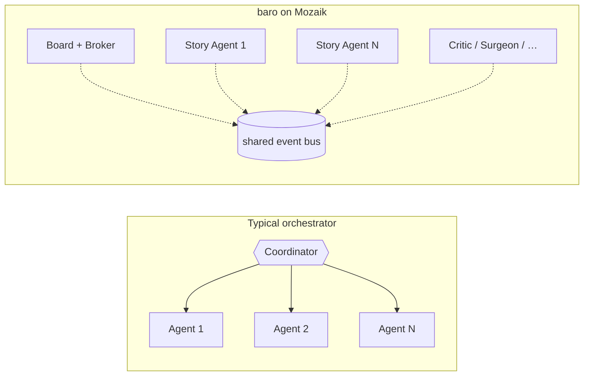

# baro

> Type a goal in your repo. Walk away. Come back to a pull request.

[](https://www.npmjs.com/package/baro-ai)
[](https://www.npmjs.com/package/baro-ai)
[](https://www.npmjs.com/package/baro-ai)

### One prompt → a 33-story plan → 808 passing tests → a pull request. In 71 minutes.

No babysitting. No copy-paste. No "now do the next file." A fleet of coding agents
planned the work, built it in parallel across isolated branches, reviewed each other,
and opened the PR — from a single sentence.

▸ [**See what happened**](https://jigjoy.ai/blog/baro-808-nestjs-jest-tests) — 33-story DAG, 64 test suites, 83.5% branch coverage, +13,606 lines, zero phantom bugs filed.

```bash
npm install -g baro-ai
cd your-repo
baro "Add JWT authentication with role-based access control"
```

**No machine, or no Claude/Codex subscription?** Run the same fleet on **baro's cloud** — nothing to install, each run in an isolated sandbox, pay as you go. → **[app.baro.jigjoy.ai](https://app.baro.jigjoy.ai)**


<sub>baro at the end of an [actual run](https://jigjoy.ai/blog/baro-808-nestjs-jest-tests) — one prompt → 33-story DAG → 32 files modified → PR opened. The summary panel shows wall time, parallel speedup (2.2×), token usage, and the PR URL.</sub>

## What happens when you run it


```mermaid
flowchart LR
    G([your goal]) --> C[Conversation<br/><sub>asks only what matters</sub>]
    C --> A[Architect<br/><sub>pins the design</sub>]
    A --> P[Planner<br/><sub>splits into a story DAG</sub>]
    P --> S[Story agents<br/><sub>parallel, isolated worktrees</sub>]
    S --> V[Critic + Verifier<br/><sub>reviews, repairs, tests</sub>]
    V --> PR([Pull Request])
```

1. **You describe the goal.** A conversation agent confirms the scope, or asks only the questions that would change it.
2. **The Architect pins the design** — file paths, schemas, API shapes, library choices — so dozens of agents don't each invent their own.
3. **The Planner splits it into a DAG of stories**, with dependencies, so independent work can run at the same time.
4. **A fleet of agents builds it**, each in its own git worktree — not one chat agent typing for an hour.
5. **It reviews and repairs itself.** A tool-less Critic gates each story; a Surgeon replans the ones that get stuck.
6. **You get a pull request**, build-verified, with a stories table and run stats.

The speedup scales with the width of your DAG, not the patience of a single session.

## Quick start

```bash
npm install -g baro-ai

baro "Migrate the hardcoded category data to a backend dictionary"

baro --quick "fix the typo on line 42 of README.md"   # skip Architect/Critic/Surgeon
baro --parallel 3 "Add unit tests for the auth module"
baro --local-only "Your goal"                          # no pushes, no PR
baro --resume                                          # pick up an existing prd.json
baro --continue "…and add refresh tokens"              # follow-up onto the same PR
baro --doctor                                          # self-diagnostic
```

Full options, `.barorc` config and per-phase overrides: [**docs.baro.rs**](https://docs.baro.rs).

## Execution modes

`--mode` decides how much runs at once. The default asks the intake to propose one and
lets you confirm it.

| mode | what it does |
|---|---|
| `auto` *(default)* | intake proposes a mode from the goal; you confirm |
| `focused` | a single story, start to finish |
| `sequential` | one story at a time, in dependency order |
| `parallel` | every ready story at once, up to `--parallel` |

## Use any model — or mix them

Same orchestration, same DAG, same prompts. The only thing that moves is which provider
each agent talks to. Auth inherits from whichever CLI you already have signed in — no API
key plumbing for the subscription backends.

```bash
baro --llm claude    "Your goal"   # default — Claude Code on an Anthropic Max subscription
baro --llm codex     "Your goal"   # Codex CLI on a ChatGPT Plus/Pro subscription
baro --llm opencode  "Your goal"   # OpenCode CLI — multi-provider agent shell
baro --llm openai    "Your goal"   # native OpenAI-compatible API (per-call billing)
baro --llm hybrid    "Your goal"   # Claude plans and reviews, Codex writes
baro --llm jigjoy    "Your goal"   # hosted baro gateway — we hold the upstream keys
```

`--llm hybrid` is the recommendation for serious runs. `--llm jigjoy` needs no provider
account at all — run `baro login` once and phases route through the hosted gateway.

Every phase also has its own override:

```bash
baro --architect-llm claude --planner-llm claude \
     --story-llm opencode --critic-llm claude --surgeon-llm claude \
     "Your goal"
```

### Custom OpenAI-compatible endpoints

Anything speaking OpenAI **Chat Completions** works with `--llm openai`. Point
`OPENAI_BASE_URL` at it and pass any model name:

```bash
OPENAI_API_KEY=your-key OPENAI_BASE_URL=https://openrouter.ai/api/v1 \
  baro --llm openai --story-model anthropic/claude-3.5-sonnet "Your goal"

OPENAI_API_KEY=not-needed OPENAI_BASE_URL=http://localhost:11434/v1 \
  baro --llm openai --story-model llama3 "Your goal"
```

`--openai-base-url` does the same and wins over the env var.

> **Gotcha.** Model names matching `gpt-*`, `o1`–`o9`, `chatgpt-*`, `text-*` or `davinci*`
> are treated as native OpenAI and go to the **Responses API** (`POST /v1/responses`),
> not Chat Completions (`POST /v1/chat/completions`) — two different wire protocols.
> Setting `OPENAI_BASE_URL` alone does not change that. Pass `--openai-base-url`
> explicitly and you get Chat Completions regardless of the model name.

### Per-story model tiering

`--llm` picks a backend per *phase*. `--tier-map` tiers per *story* instead: the Planner
tags each story by blast radius — `light` (mechanical), `standard` (one module), `heavy`
(cross-cutting, schema, a DAG hub) — and the map binds each tier to a `backend:model`.

```bash
# Cheap single-concern stories on MiniMax, cross-cutting stories on Claude Opus
baro --openai-endpoint minimax=https://api.minimax.io/v1 \
     --tier-map "light=openai:MiniMax-M3@minimax,standard=openai:MiniMax-M3@minimax,heavy=claude:opus" \
     "Your goal"
```

A route can name any backend (`claude:opus`, `openai:MiniMax-M3`, `codex:gpt-5.5`), and an
OpenAI route can name its own endpoint with `@` — so one run can hit several endpoints at
once. Keys never go on the command line: each endpoint reads `BARO_OPENAI_KEY_<NAME>`,
falling back to `OPENAI_API_KEY`.

Provider economics and a side-by-side benchmark across three real tasks:
[**Claude Code vs OpenAI Codex in my parallel agent setup**](https://jigjoy.ai/blog/claude-code-vs-codex-baro).

## Under the hood: participants on an event bus

Most multi-agent setups put one orchestrator function in the middle driving N agents. That
orchestrator becomes the bottleneck the moment you go past a handful of concurrent agents,
and every new behaviour means editing its control flow.

baro has no such function. Every role is a participant on a shared event bus
([Mozaik](https://github.com/jigjoy-ai/mozaik)), reacting to typed events:


```mermaid
flowchart LR
    subgraph A["Typical orchestrator"]
        direction TB
        C{{Coordinator}}
        C --> A1[Agent 1]
        C --> A2[Agent 2]
        C --> A3[Agent N]
    end
    subgraph B["baro on Mozaik"]
        direction TB
        Bus[(shared event bus)]
        P1[Board + Broker] -.-> Bus
        P2[Story Agent 1] -.-> Bus
        P3[Story Agent N] -.-> Bus
        P4[Critic / Surgeon / …] -.-> Bus
    end
```

| Participant | Role |
|---|---|
| **Conversation** | Sole user-facing intake; turns a sentence into one accepted goal, and survives restarts |
| **RepoScout** | Read-only researcher that investigates the repo before planning; cannot run code or write |
| **Architect** | One strong-model design pass; its decisions are pinned for every story |
| **Planner** | Decomposes the goal into a story DAG |
| **Board + Broker** | Scheduling and ownership: the Board arbitrates the graph, the Broker auctions and grants leases |
| **StoryAgent** | One isolated worker per story, in its own git worktree |
| **Critic + AcceptanceGate** | Evaluates each story against its acceptance criteria and blocks or corrects |
| **GoalGuardian** | Independent goal authority — attests completion from evidence; cannot schedule or merge |
| **Surgeon** | Replans a failed story: split, add a prerequisite, rewire, or escalate |
| **Librarian + Sentry** | Share findings between siblings; flag overlapping edits across concurrent stories |
| **RunVerifier / Finalizer** | Produces build/test evidence and opens the PR from it |

Because it's a bus, adding a participant — a CI deployer, a Slack notifier, a ticket
trigger — changes no existing code. Workers can also message each other and propose
changes to not-yet-started parts of the DAG; the Board stays the only thing allowed to
mutate it.

**Details:** [collective runtime architecture](docs/collective-runtime.md) covers the
execution guarantees, lease and authority fencing, failure policy, runtime DAG changes,
progressive planning, and the provider-free verification contract. The
[local collective experiment](docs/collective-experiment.md) is the hands-on guide.

## Semantic memory

Parallel agents share what they discover. When one reads a file or greps a pattern, the
finding is embedded locally (CPU-only ONNX, no API calls) and indexed, so siblings don't
redo the same exploration — only semantically relevant findings get injected.

```bash
baro "your goal"           # on by default
baro --no-memory "goal"    # off
BARO_DEBUG=memory baro …   # debug to stderr + ~/.baro/runs/memory-*.log
```

Worth it on large codebases with overlapping exploration and DAGs where later stories
build on earlier ones. Adds ~1s of startup and little else on 1–3 file tasks.

## Run it from the cloud — `baro connect`

baro can run as a **remote runner**: fire a goal from a web dashboard, a teammate, or a
GitHub issue labeled `baro`, and it executes here on your machine over your own
subscription. baro-cloud orchestrates and never sees your source — only metadata and diffs.

```bash
curl -fsSL https://api.baro.jigjoy.ai/install.sh | sh -s -- --token rt_…
```

That installs baro and registers a background service that survives terminal close,
logout and reboot — launchd, systemd, or a Windows logon task. By hand:

```bash
baro connect --install-service --token rt_…   # persistent background service
baro connect --token rt_…                      # foreground, this terminal only
baro connect --uninstall-service               # remove it
```

Get a pairing token from baro-cloud → Runners. A mid-run network blip won't kill a run:
the runner reconnects and resumes streaming where it left off.

**No machine or subscription?** baro-cloud can run the goal entirely on our
infrastructure, billed from prepaid credits — pick **☁ baro's cloud** at
[app.baro.jigjoy.ai](https://app.baro.jigjoy.ai).

## Requirements

- Node.js 20+, and at least one of:
  - [Claude CLI](https://docs.anthropic.com/en/docs/claude-cli) signed in — for `--llm claude` (default)
  - [Codex CLI](https://github.com/openai/codex) signed in — for `--llm codex`
  - [OpenCode CLI](https://opencode.ai) with a provider — for `--llm opencode`
  - `OPENAI_API_KEY` (optionally `OPENAI_BASE_URL`) — for `--llm openai`
  - nothing at all — `baro login`, then `--llm jigjoy`
- macOS (arm64/x64), Linux (x64/arm64), Windows (x64)
- `gh` CLI, optional, for automatic PR creation

## Status & feedback

baro is a work in progress. If a run explodes, the audit log at `~/.baro/runs/<run-id>.jsonl`
is the fastest way to get it fixed — open an [issue](https://github.com/jigjoy-ai/baro/issues)
with that file attached.

Discord: [**discord.gg/dvxY9J2kWX**](https://discord.gg/dvxY9J2kWX) · Twitter: [**@lotus_sbc**](https://twitter.com/lotus_sbc)

## License

MIT — [JigJoy](https://jigjoy.ai/) team
